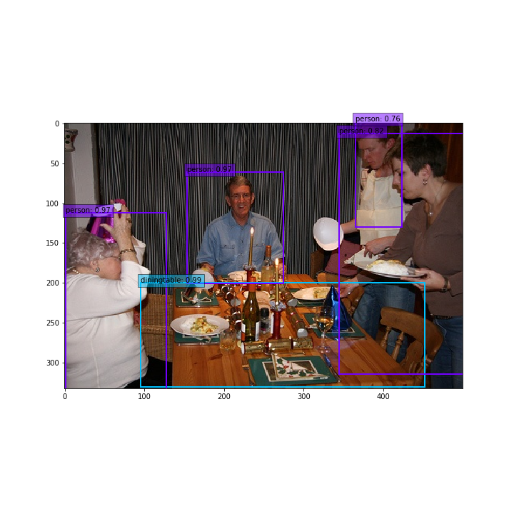
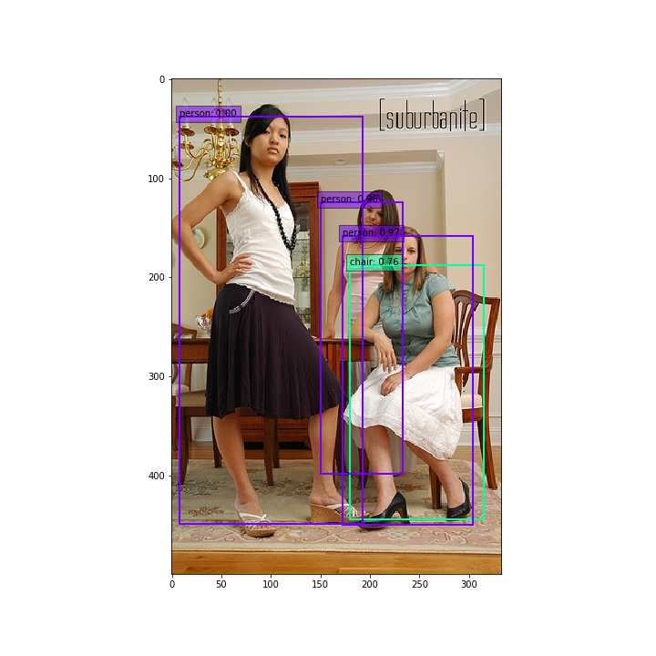

# SSD: Single Shot MultiBox Object Detector, in PyTorch
### Table of Contents
- <a href='#introduction'>Introduction</a>
- <a href='#installation'>Installation</a>
- <a href='#datasets'>Datasets</a>
- <a href='#train'>Train</a>
- <a href='#test'>Test</a>
&nbsp;
&nbsp;
## Introduction
This is the SSD model based on project by [Max DeGroot](https://github.com/amdegroot/ssd.pytorch/). I corrected some bugs in the code and successfully run the code on GPUs at Google Cloud.  

[SSD (Single Shot MultiBox Object Detector)](https://arxiv.org/pdf/1512.02325.pdf) is able to detect objects in an image with bounding boxes. The method is faster than [faster-RCNN](http://papers.nips.cc/paper/5638-faster-r-cnn-towards-real-time-object-detection-with-region-proposal-networks.pdf) and [mask-RCNN](https://arxiv.org/pdf/1703.06870.pdf%20http://arxiv.org/abs/1703.06870.pdf) and still yield a good accuracy.

## Installation
- Install [PyTorch](http://pytorch.org/) by selecting your environment on the website and running the appropriate command.
- Clone this repository.
  * Note: We currently only support Python 3+.
- Then download the dataset by following the [instructions](#datasets) below.
- We support [Visdom](https://github.com/facebookresearch/visdom) for real-time loss visualization during training!
  * To use Visdom in the browser:
  ```Shell
  # First install Python server and client
  pip install visdom
  # Start the server (probably in a screen or tmux)
  python -m visdom.server
  ```
  * Then (during training) navigate to http://localhost:8097/ (see the Train section below for training details).
- Note: For training, we currently support [VOC](http://host.robots.ox.ac.uk/pascal/VOC/), and aim to add and [COCO](http://mscoco.org/) [ImageNet](http://www.image-net.org/) support in the future.

## Datasets
To make things easy, we provide bash scripts to handle the dataset downloads and setup for you.  We also provide simple dataset loaders that inherit `torch.utils.data.Dataset`, making them fully compatible with the `torchvision.datasets` [API](http://pytorch.org/docs/torchvision/datasets.html).
### VOC Dataset
PASCAL VOC: Visual Object Classes
##### Download VOC2007 trainval & test
```Shell
git clone https://github.com/yczhang1017/SSD_resnet_pytorch.git
# navigate to the home directory of SSD model, dataset will be downloaded into data folder
cd SSD_resnet_pytorch
# specify a directory for dataset to be downloaded into, else default is ~/data/
sh data/scripts/VOC2007.sh # <directory>
```
##### Download VOC2012 trainval
```Shell
# specify a directory for dataset to be downloaded into, else default is ~/data/
sh data/scripts/VOC2012.sh # <directory>
```

### COCO(not fully implemented yet)
Microsoft COCO: Common Objects in Context

##### Download COCO 2014
```Shell
# specify a directory for dataset to be downloaded into, else default is ~/data/
sh data/scripts/COCO2014.sh
```
## Training SSD
- First download the fc-reduced [VGG-16](https://arxiv.org/abs/1409.1556) PyTorch base network weights at:              https://s3.amazonaws.com/amdegroot-models/vgg16_reducedfc.pth
- By default, we assume you have downloaded the file in the `ssd.pytorch/weights` dir:

```Shell
cd weights
wget https://s3.amazonaws.com/amdegroot-models/vgg16_reducedfc.pth
#adjust the keys in the weights file to fit for current model
python3 vggweights.py
cd ..
```

- To train SSD using the train script simply specify the parameters listed in `train.py` as a flag or manually change them.

```Shell
#use vgg 
python3 train.py 
#If use resNet 
python3 train.py --model 'resnet' --basenet 'resnet50.pth' 
#if you don't want the training to stop after you log out
nohup python3 -u train.py --model 'resnet' --basenet 'resnet50.pth' > r1.log </dev/null 2>&1
```
- Note:
  * For training, an NVIDIA GPU is strongly recommended for speed. It takes about two days to iterate over 120000x24 images for using Tesla K80 GPU. resNet50 takes a little bit longer than VGG16. I guess the time would be within one day, if you use Tesla P4 or P100.
  * For instructions on Visdom usage/installation, see the <a href='#installation'>Installation</a> section.
  * You can pick-up training from a checkpoint by specifying the path as one of the training parameters (again, see `train.py` for options)

## Test
### Use a pre-trained SSD network for detection
#### Download a pre-trained network
- We are trying to provide PyTorch `state_dicts` (dict of weight tensors) of the latest SSD model definitions trained on different datasets.  
- Currently, we provide the following PyTorch models:
    * SSD300 trained on VOC0712 (newest PyTorch weights)
      - https://s3.amazonaws.com/amdegroot-models/ssd300_mAP_77.43_v2.pth
    * SSD300 trained on VOC0712 (original Caffe weights)
      - https://s3.amazonaws.com/amdegroot-models/ssd_300_VOC0712.pth
```Shell      
cd weights
wget https://s3.amazonaws.com/amdegroot-models/ssd300_mAP_77.43_v2.pth
#adjust the keys in the weights file to fit for current model
python3 ssdweights.py      
```
#### Test and evaluate mean AP (average precision)
- To test a trained network:
```Shell
#use vgg 
python3 test.py
#If use resNet
python3 test.py --model 'resnet' --trained_model 'weights/ssd300_resnet.pth'
```
Currently, we got mAP 86% for VGG16 and %67 for resNet50.

#### Display images
```Shell
#use vgg 
python3 demo.py
```
The output images are shown in demo folder




## References
- Wei Liu, et al. "SSD: Single Shot MultiBox Detector." [ECCV2016]((http://arxiv.org/abs/1512.02325)).
- SSD model in PyTorch by [Max DeGroot](https://github.com/amdegroot/ssd.pytorch/)
- [Original Implementation (CAFFE)](https://github.com/weiliu89/caffe/tree/ssd)
- A huge thank you to [Alex Koltun](https://github.com/alexkoltun) and his team at [Webyclip](webyclip.com) for their help in finishing the data augmentation portion.
- A list of other great SSD ports that were sources of inspiration (especially the Chainer repo):
  * [Chainer](https://github.com/Hakuyume/chainer-ssd), [Keras](https://github.com/rykov8/ssd_keras), [MXNet](https://github.com/zhreshold/mxnet-ssd), [Tensorflow](https://github.com/balancap/SSD-Tensorflow)
